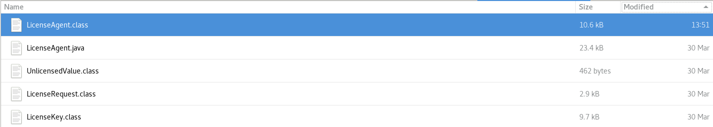
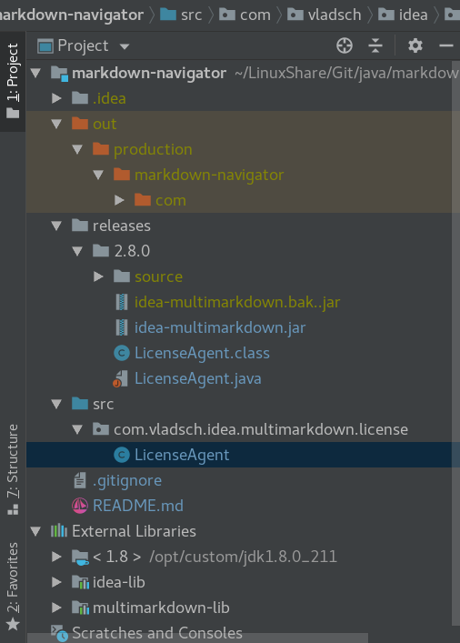
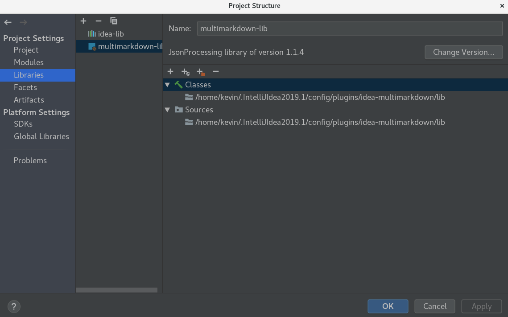

# 破解 Markdown Navigator 2.8.4

本文Fork自CrazyBunQnQ/multimarkdown(非常感谢您的无私奉献)，以IDE版本2019.1.2、Markdown Navigator 2.8.4版本为例说明！

## 安装 Markdown Navigator 插件

本文采用从磁盘安装的方式安装插件，从[此处](https://plugins.jetbrains.com/plugin/7896-markdown-navigator)下载安装包，安装后插件目录位于：{HOME}.IntelliJIdea2019.1/config/plugins.

## 修改文件

将重新编译后的 [`LicenseAgent.class`](https://github.com/dcfenga/markdown-navigator/tree/master/releases/2.8.0)文件拷贝到 Markdown Navigator 插件安装目录 `/lib/idea-multimarkdown.jar` 包中的 `com.vladsch\idea\multimarkdown\license` 目录下，覆盖原有的 `LicenseAgent.class` 文件。

>具体修改方法、内容感兴趣的可以看后面的[详细破解方法](#详细破解方法)和 [`LicenseAgent.java`](https://github.com/dcfenga/markdown-navigator/tree/master/src/com/vladsch/idea/multimarkdown/license)。

### 使用压缩工具打开 `idea-multimarkdown.jar` 按下图所示替换 .class 文件即可
**替换后一定要确认下被替换的 .class 文件修改时间与其他文件修改时间不同。**



完成上面的操作后重启 IDEA 即可。

## 详细破解方法

>默认你已经安装好插件了。
>
>`x` 为你的 IDEA 版本。

### 创建项目

>实际直接克隆此项目即可,
>以下路径根据自己电脑情况有所变化。

创建项目时必须创建 `com.vladsch.idea.multimarkdown.license` 包，与原始 jar 包中的结构一致:


### 修改文件

```bash
# 1. 将安装好的插件拷贝出来，并保存为 `idea-multimarkdown.bak.jar` 作为备份
cd 你的项目目录
cp {HOME}/.IntelliJIdea2019.1/config/plugins/idea-multimarkdown/lib/idea-multimarkdown.jar ./releases/2.8.0/idea-multimarkdown.bak.jar
# 2. 解压插件
cd releases/2.8.0
# 解压到 source 文件夹(没找到解压到指定文件夹的参数...)
cp idea-multimarkdown.bak.jar ./source/
cd source
jar xvf idea-multimarkdown.bak.jar && rm -f idea-multimarkdown.bak.jar
# 将要修改的 LicenseAgent.java 拷贝到上面创建的包里
cd 你的项目目录
cp releases/2.8.0/source/com/vladsch/idea/multimarkdown/license/LicenseAgent.java src/com/vladsch/idea/multimarkdown/license/
```

### 编译文件

打开 `LicenseAgent.java` 文件你会发现很多报错，无法编译，是因为没有依赖包。

编译前首先需要引入 IDEA 和 multimarkdown 的依赖包。

IDEA 依赖包在 IDEA 安装目录中，multimarkdown 的依赖包在该插件目录中:



>路径参考图中路径

导入依赖后菜单 `Build` → `Build Project` 编译项目。

然后会生成 out 目录，编译好的 `.class` 文件就在这里。

### 重新打包

```bash
cd 项目目录
# 将修改后的 LicenseAgent.class 文件拷贝到解压后的 jar 包中
cp out/production/multimarkdown/com/vladsch/idea/multimarkdown/license/LicenseAgent.class ./releases/2.8.0/source/com/vladsch/idea/multimarkdown/license/
# 重新打包并移到上层目录
cd releases/2.8.0/source && jar cvf idea-multimarkdown.jar * && mv idea-multimarkdown.jar ../
# 将打好的包拷贝到 IDEA 插件目录中覆盖掉原文件
cd ..
cp idea-multimarkdown.jar {HOME}/.IntelliJIdea2019.1/config/plugins/idea-multimarkdown/lib/idea-multimarkdown.jar
```

完成以上步骤后重启 IDEA 即可

## 参考

[破解 IntelliJ IDEA 插件 Markdown Navigator](https://code.skyheng.com/post/54321.html)
